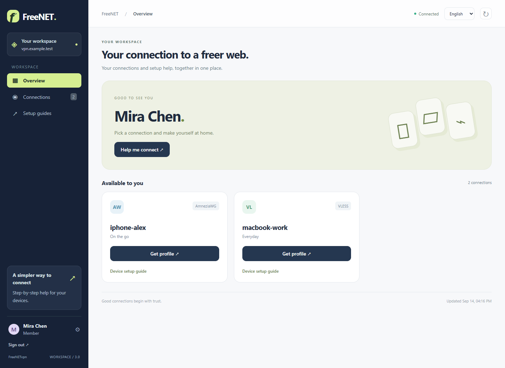
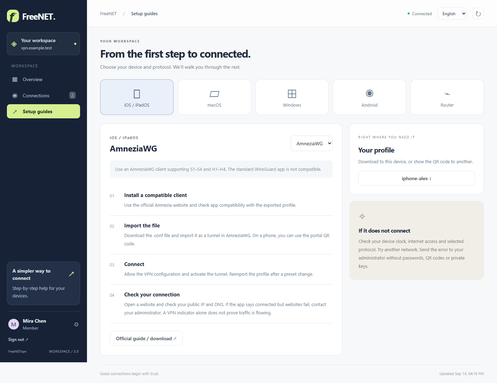

# FreeNETvpn · Workspace 3

**English** · [Русский](README.ru.md)

A private VPN workspace for your people. Six protocols, one server, a bilingual dashboard and personal connection access.


## Your server. Your people.

- **Administrators** manage services, VPN profiles, accounts, assignments and backups.
- **Members** see only assigned profiles, downloads/QR codes and device setup guides.
- **People management:** add administrators or members, assign profiles, disable/delete accounts, reset passwords and review account changes. The original installation owner is protected.
- **Russian and English** interface, persistent language selection, desktop and phone layouts.
- **Guides for iOS, macOS, Windows, Android and routers**, with protocol-specific compatibility notes.
- WireGuard, VLESS (WebSocket/TLS and gRPC/TLS), IKEv2, L2TP/IPsec, Outline and AmneziaWG. Three ready-made VLESS and three AmneziaWG presets.


## One-command deployment

Requires a clean **Ubuntu 22.04/24.04/26.04 LTS x86_64** server with systemd, root/sudo and public IPv4. Point two DNS A records (e.g. vpn.example.com and wg.example.com) at it. Allow TCP 80/443 and the selected [VPN ports](docs/protocols.md) in the provider firewall. Remove unusable AAAA records. Do not put UDP endpoints behind an HTTP-only proxy.

This version is on [PR #1](https://github.com/evdokimenkoiv/FreeNETvpn/pull/1), branch `codex/freenetvpn-reliability`; main still contains the previous version.

```bash
sudo bash -c 'set -e; apt-get update -qq; apt-get install -y ca-certificates curl; export FREENET_REF=codex/freenetvpn-reliability; f=$(mktemp); trap "rm -f -- \"$f\"" EXIT; curl -fsSL "https://raw.githubusercontent.com/evdokimenkoiv/FreeNETvpn/${FREENET_REF}/install.sh" -o "$f"; bash "$f"'
```

The installer downloads the full project to /opt/freenetvpn and asks for both domains, certificate email and an administrator password (16+ characters). It installs Docker/Compose, renders and validates all selected services, starts the local control agent and verifies HTTPS/authentication. SSH settings and existing keys are preserved. The wg-easy setup wizard is completed separately after installation.

In an already downloaded checkout, use `sudo bash install.sh`. `sudo bash install.sh --existing` reapplies existing configuration; it does **not** fetch new code. `--no-firewall` leaves UFW to the operator. `bash install.sh --help` is read-only. See [upgrade instructions in English](docs/accounts.en.md#upgrade-and-recovery) and [deployment details in Russian](docs/deployment.md).

## First connection and people

Open `https://YOUR_DOMAIN/admin` with your installation account. Complete the native WireGuard wizard at the second hostname (outer credentials are the portal administrator's; create a separate native wg-easy account). Set endpoint to the main domain and port to WG_PORT, then connect the native account in the portal.

Create a per-device VPN profile in **Connections**. In **People → Add person**, choose administrator or member; members receive only the profiles you explicitly select. Share the username and initial password privately. Members can change their password from the account button. [Full account/permission guide](docs/accounts.en.md).



Open **Setup guides**, choose your device and protocol, then download your assigned profile. [Device instructions in English](docs/devices.en.md) · [Инструкции на русском](docs/devices.ru.md).



Screenshots show the real UI with **simulated data**, not a production server or live keys. [Reproduce screenshots and view mobile layout](docs/images/README.md).

## Operations

From /opt/freenetvpn: `sudo bash scripts/health_check.sh` checks services/TLS/authentication. Create and download a backup in the portal, or run `sudo bash scripts/backup.sh`. Archives include .env, runtime, VPN keys and account state. Copy them off the server privately.

To restore, obtain a fresh checkout of the same version, with no .env/runtime/data, run `sudo bash restore.sh /path/to/archive.tar.gz`, review DNS, then `sudo bash install.sh --existing`. Restore refuses to overwrite an existing installation. [Migration](docs/migration.md) covers legacy v1 data.

**Disabling/deleting a portal account does not revoke downloaded VPN keys.** Revoke its profiles in Connections to terminate VPN access. Assignment changes and password resets invalidate old portal sessions. Administrator accounts have access to all keys and backups; ordinary members cannot reach those administrative endpoints or native wg-easy.

## Verification and scope

The web container stays non-root/read-only with no Docker socket. Fixed operations run through an authenticated local Unix/systemd agent. PBKDF2 password hashes and account state are private; no credentials belong in Git. Role enforcement applies to HTTP APIs, QR, downloads and Basic authentication, not only navigation visibility.

Run `python -m pip install -r requirements-dev.txt`, then `python -m pytest -q`. CI also verifies the exact README bootstrap, shell lint, real VPN packet tests on Ubuntu 22.04/24.04, browser flows and official Spec Kit contexts on Ubuntu/Windows. [Multiuser validation](docs/multiuser-validation.md) · [VPS qualification](docs/vps-qualification.md) · [remaining external acceptance](docs/acceptance.md).

Official Spec Kit 1.0.6 is pinned. Six feature directories cover the core, protocols, dashboard, Spec Kit integration, multiuser workspace and proxy/recovery extension. Run `python tools/spec_audit.py` and `python tools/check_spec_contexts.py`. The documented internal SDD score is not a GitHub certification or proof of every native client/network. [Developer workflow](docs/spec-kit.md).

## License

See [LICENSE](LICENSE).

## Optional proxies and recovery

MTProto for Telegram and authenticated HTTP CONNECT/SOCKS5 are optional services. Enable with `sudo python3 tools/manage.py services all`, then `sudo bash install.sh --existing`. Create and assign profiles in the dashboard. MTProto supports 16 profiles; HTTP/SOCKS is TCP only and its own transport is unencrypted. Use it over VPN on untrusted networks.

[Restore a backup](docs/recovery.en.md).
