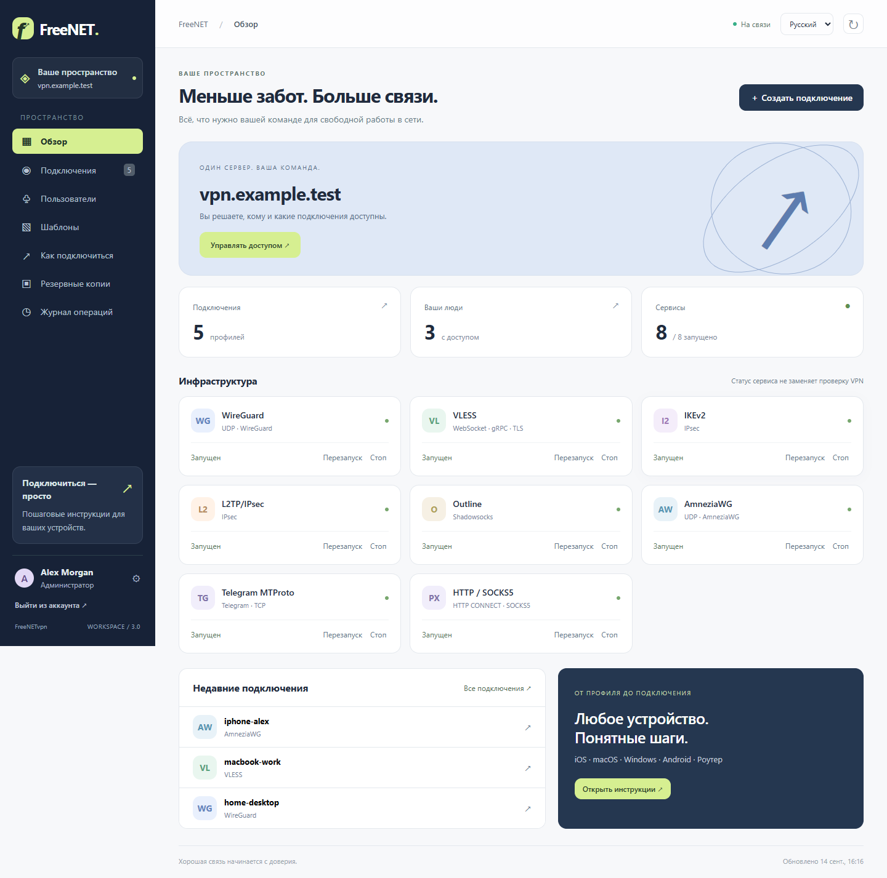
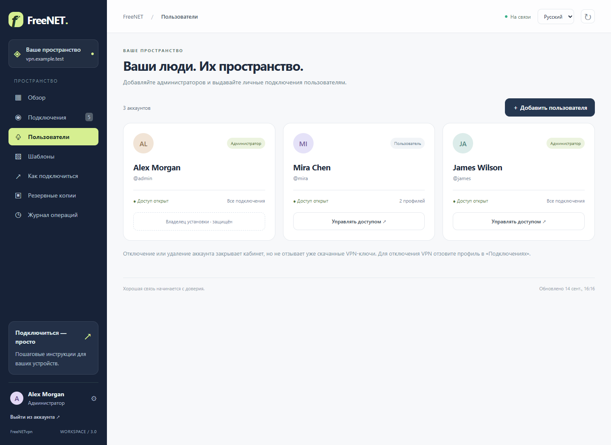
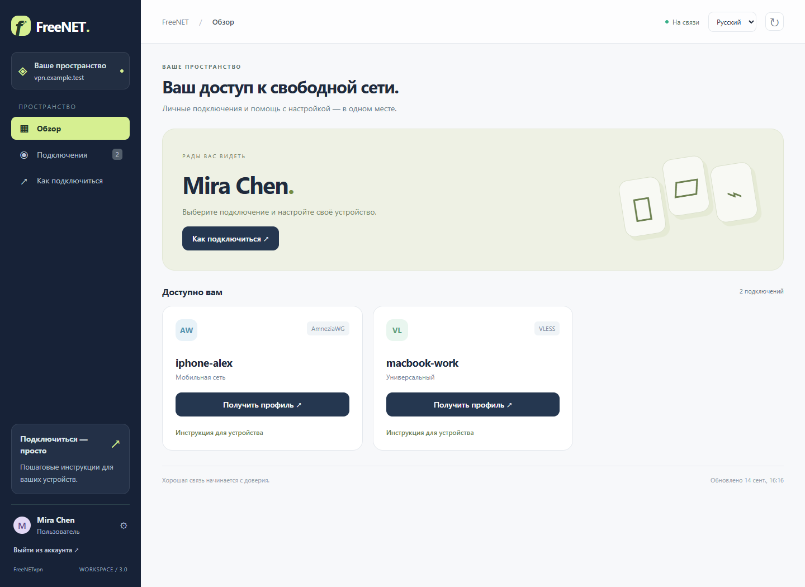

# FreeNETvpn · Workspace 3

[English](README.md) · **Русский**

Личный VPN-сервер для вашей команды. Шесть протоколов, удобный кабинет на двух языках и отдельный доступ к подключениям для каждого пользователя.



## Ваш сервер. Ваши люди.

- **Администраторы** управляют сервисами, профилями VPN, аккаунтами, назначениями и резервными копиями.
- **Пользователи** видят только назначенные им профили, скачивание/QR-коды и инструкции для устройств.
- **Управление аккаунтами:** создание администраторов и пользователей, выдача профилей, отключение, удаление, сброс пароля и журнал изменений. Исходный владелец защищён от удаления.
- **Русский и английский:** переключатель языка с сохранением выбора, интерфейс для компьютера и телефона.
- **Инструкции для iOS, macOS, Windows, Android и роутеров** с учётом совместимости протокола.
- WireGuard, VLESS (WebSocket/TLS и gRPC/TLS), IKEv2, L2TP/IPsec, Outline, AmneziaWG. По три предустановленных шаблона VLESS и AmneziaWG.



## Развёртывание одной командой

Нужен чистый сервер **Ubuntu 22.04/24.04/26.04 LTS x86_64** с systemd, root/sudo и публичным IPv4. Направьте на него две DNS A-записи, например vpn.example.com и wg.example.com. Откройте у провайдера TCP 80/443 и [порты выбранных VPN](docs/protocols.md); удалите неработающие AAAA-записи. UDP-точки не должны находиться за HTTP-прокси.

Эта версия находится в [PR #1](https://github.com/evdokimenkoiv/FreeNETvpn/pull/1), ветка `codex/freenetvpn-reliability`; в main пока предыдущая версия.

```bash
sudo bash -c 'set -e; apt-get update -qq; apt-get install -y ca-certificates curl; export FREENET_REF=codex/freenetvpn-reliability; f=$(mktemp); trap "rm -f -- \"$f\"" EXIT; curl -fsSL "https://raw.githubusercontent.com/evdokimenkoiv/FreeNETvpn/${FREENET_REF}/install.sh" -o "$f"; bash "$f"'
```

Установщик получает весь проект в /opt/freenetvpn, спрашивает два домена, email для сертификатов и пароль администратора (16+ символов). Устанавливает Docker/Compose, проверяет и запускает выбранные протоколы, локальный агент, HTTPS и защиту входа. SSH и существующие ключи сохраняются. Мастер wg-easy завершается отдельно после установки.

В скачанном проекте достаточно `sudo bash install.sh`. `sudo bash install.sh --existing` повторно применяет настройки, **не скачивая новый код**. `--no-firewall` оставляет UFW оператору. `bash install.sh --help` ничего не устанавливает. [Развёртывание и обновление](docs/deployment.md).

## Первое подключение и пользователи

Откройте `https://ВАШ_ДОМЕН/admin`, войдите исходным аккаунтом. На втором домене завершите мастер WireGuard: внешняя защита использует доступ администратора кабинета, а внутренний аккаунт wg-easy создаётся отдельно. Endpoint — основной домен, порт — WG_PORT. Подключите внутренний аккаунт в кабинете.

Создайте отдельный профиль устройства в **Подключениях**. В **Пользователи → Добавить пользователя** выберите роль и назначьте нужные профили. Логин и первоначальный пароль передайте лично. Пользователь сможет изменить пароль через кнопку аккаунта. [Управление правами](docs/accounts.ru.md).



Раздел **Как подключиться** помогает выбрать устройство и протокол, получить профиль и пройти настройку. [Инструкции на русском](docs/devices.ru.md) · [English device guides](docs/devices.en.md).

Скриншоты сняты с настоящего интерфейса на **демонстрационных данных**. Они не содержат боевых ключей или адреса владельца. [Снимки интерфейса и их воспроизведение](docs/images/README.md).

## Обслуживание

В /opt/freenetvpn команда `sudo bash scripts/health_check.sh` проверяет сервисы, HTTPS и вход. Копию создайте и скачайте в кабинете либо выполните `sudo bash scripts/backup.sh`. Архив включает .env, runtime, VPN-ключи и аккаунты. Сохраните его вне сервера приватно.

Восстановление: скачайте чистый проект той же версии без .env/runtime/data, выполните `sudo bash restore.sh /путь/к/архиву.tar.gz`, проверьте DNS, затем `sudo bash install.sh --existing`. Восстановление поверх имеющихся данных запрещено. Для старого v1 предусмотрена отдельная [миграция](docs/migration.md).

**Отключение или удаление аккаунта кабинета не отзывает уже скачанные VPN-ключи.** Для прекращения VPN-доступа отзовите профили в «Подключениях». Смена пароля или прав завершает старые сессии. Администраторы имеют доступ ко всем ключам и архивам; обычные пользователи не имеют доступа к административным API и родному wg-easy.

## Проверки и границы

Веб-контейнер работает без root, с файловой системой только для чтения и без Docker socket. Ограниченные операции выполняются через защищённый Unix/systemd-агент. Пароли хранятся как PBKDF2-хеши; аккаунты и секреты не попадают в Git. Роли проверяются сервером для API, QR, скачивания и Basic Auth.

Установите зависимости `python -m pip install -r requirements-dev.txt`, запустите `python -m pytest -q`. CI также проверяет точную команду README, shell lint, реальный VPN-трафик на Ubuntu 22.04/24.04, браузер и контекст Spec Kit на Windows/Ubuntu. [Отчёт новой версии](docs/multiuser-validation.md) · [Проверки VPS](docs/vps-qualification.md) · [Оставшаяся внешняя приёмка](docs/acceptance.md).

Закреплён официальный Spec Kit 1.0.6. Шесть спецификаций описывают ядро, протоколы, кабинет, интеграцию Spec Kit, многопользовательский режим и расширение прокси/восстановления. Проверки: `python tools/spec_audit.py` и `python tools/check_spec_contexts.py`. Внутренняя оценка SDD не является сертификацией GitHub или проверкой всех устройств/сетей. [Инструкция разработчика](docs/spec-kit.md).

## Лицензия

[LICENSE](LICENSE).

## Дополнительные прокси и восстановление

MTProto для Telegram и HTTP CONNECT/SOCKS5 с авторизацией доступны как дополнительные сервисы. Включение: `sudo python3 tools/manage.py services all`, затем `sudo bash install.sh --existing`. Создавайте и назначайте профили в кабинете. MTProto поддерживает 16 профилей; HTTP/SOCKS работает только с TCP, собственный транспорт не шифрует. В недоверенной сети используйте его через VPN.

[Восстановление резервной копии](docs/recovery.ru.md).
