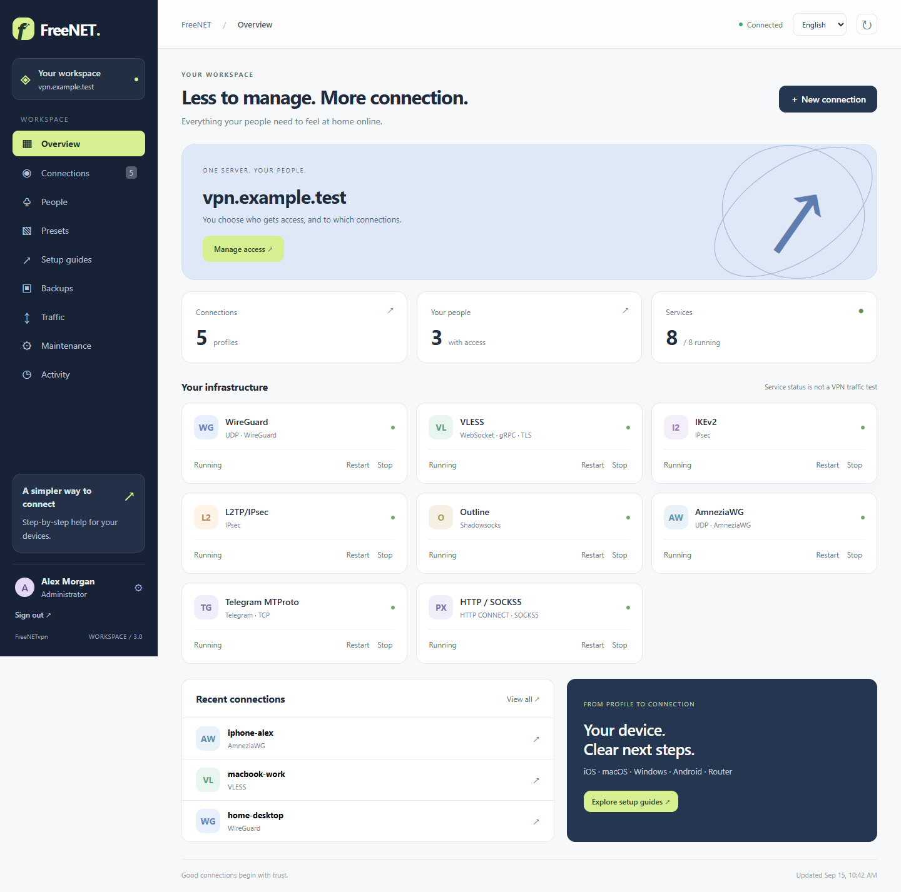
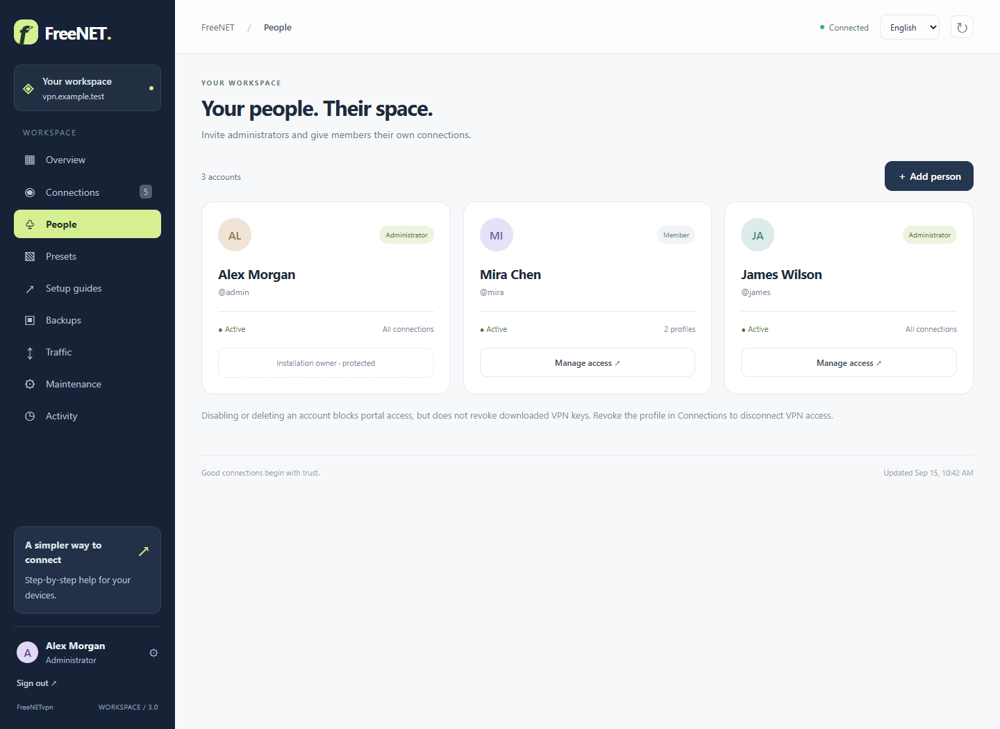
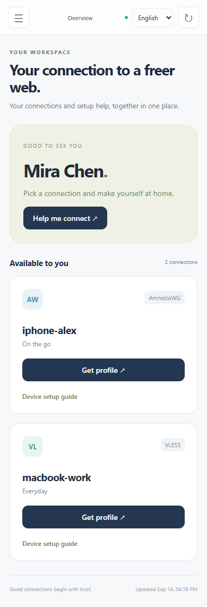
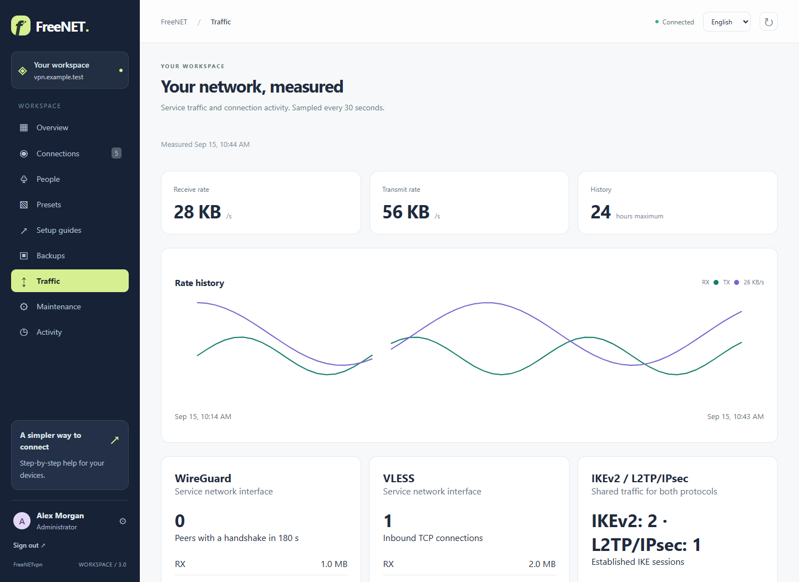
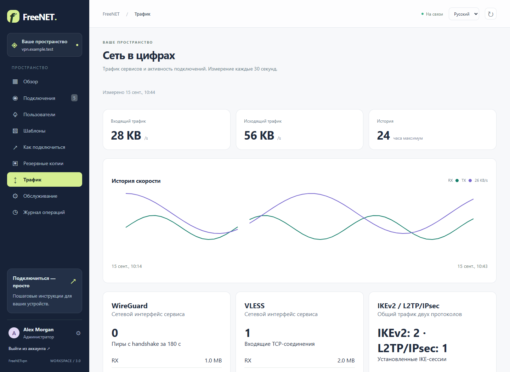
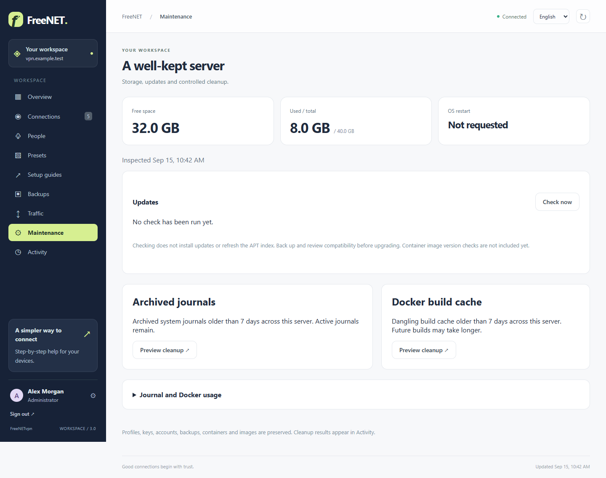
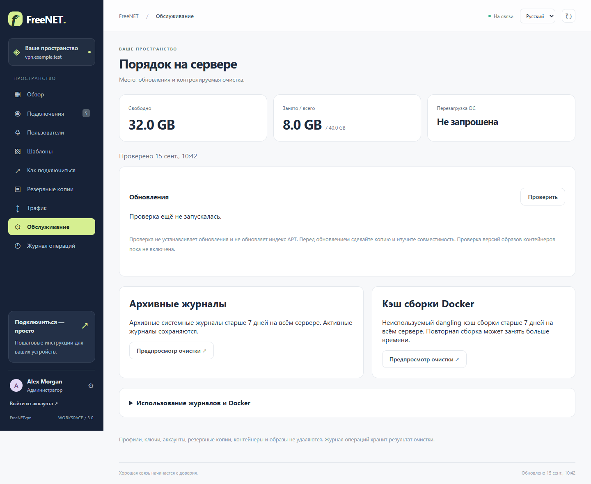

# Interface gallery / Интерфейс

These are screenshots of the actual UI using the explicit simulated API in tests/ui.cjs. Demo names, hostnames, counts and profiles are fictional; no live keys or server addresses are published.

Скриншоты настоящего интерфейса сняты с демонстрационным API tests/ui.cjs. Имена, адреса и профили вымышлены. Боевых ключей и адресов сервера в этих изображениях нет.

Reproduce / Воспроизведение: install the CI-pinned Playwright version and Chromium, then run `node tests/ui.cjs` from the repository root. Images are written to runtime/ui-screenshots. Inspect them before copying into this directory. No production credentials are required. BROWSER_EXECUTABLE optionally selects an installed Chromium/Chrome.

